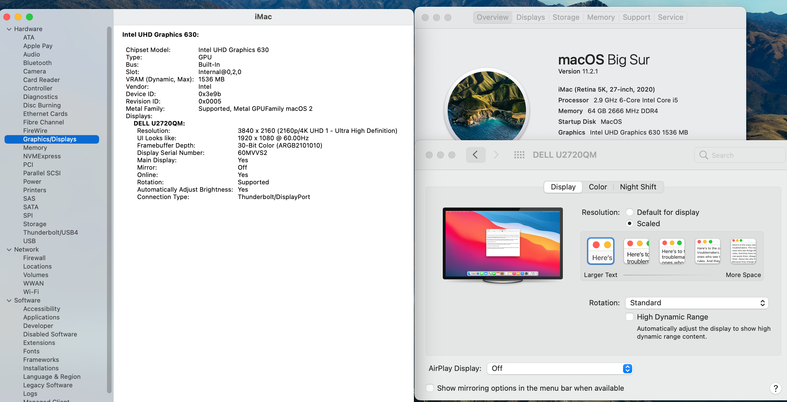

# Lenovo-P340-Tiny-Hackintosh
Lenovo P340 Tiny Hackintosh 完美

macOS Big Sur 11.2.1 (20D75)

硬件配置:

CPU: i5 10400

RAM: Samsung 32GB 3200 *2 SODIMM

SSD: Samsung 970 EVO Plus 500GB

WiFi: BCM943602CS + Adapter

SMBIOS type  iMac20,1

BIOS 设置

1.Devices->ATA Drive Setup->Configure SATA as AHCI

2.Devices->Video Setup->Select Active Video:IGD,Pre-Allocated Memory Size 64MB(or larger)

3.Security->Secure Boot->Secure Boot ->Disable

DP接显示器没有音频输出

